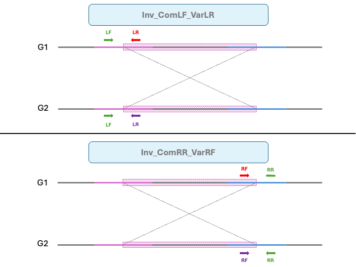
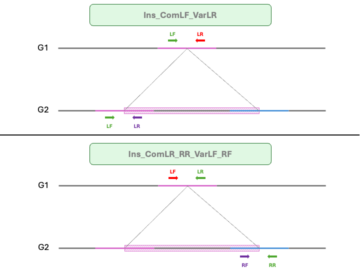
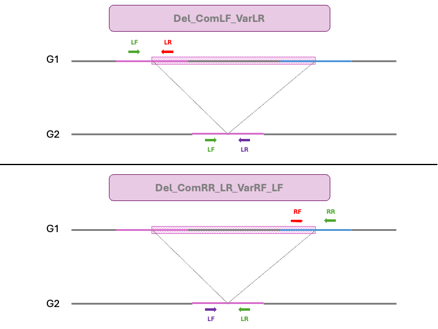

# svmarkers

**SV Markers Primer Screening Pipeline**

`svmarkers` is a CLI tool designed to generate and quality-control PCR primers targeted at Structural Variants (SVs) using genome assemblies and SyRI annotations.

---

## Features

- **Primer Extraction (`extract`):** Generates candidate primer pairs around structural variations (`INS`, `INV`, `DEL`, `CPL`, `CPG`).
- **Quality Control (`qc`):** Performs thermodynamic, sequence repeat, and BLAT-based specificity filtering on custom primer sets.
- **Configurable Filtering:** Fine-tune product sizes, melting temperatures ($T_m$), GC content, and secondary structure constraints.

---

## Installation

```bash
# create conda environment with pblat
conda create -n svmarkers python=3.14 pblat -c bioconda -c conda-forge
conda activate svmarkers

# Clone repository
git clone https://github.com/sivasubramanics/svmarkers.git
cd svmarkers

# Install package
pip install -e .
```
---
## Quick Start

### 1. Extract Primers for SVs

Identify structural variants and design flanking primer pairs:

```bash
svmarkers extract \
  --genome1 reference.fasta \
  --genome2 query.fasta \
  --syri syri.out \
  --outdir output_dir \
  --threads 8

```

### 2. Quality Control (QC) Existing Primers

Evaluate and filter a set of primers against genome assemblies:

```bash
svmarkers qc \
  --primers primers.fasta \
  --genome genome1.fasta \
  --genome genome2.fasta \
  --outdir qc_results \
  --threads 8

```

---

## Command Reference

### `svmarkers extract`

Extracts target SV regions and designs optimal primer pairs.

#### Required Options

| Option | Short | Description |
| --- | --- | --- |
| `--genome1` | `-a` | Path to reference genome FASTA |
| `--genome2` | `-b` | Path to query genome FASTA |
| `--syri` | `-s` | Path to SyRI output file |

#### General Parameters

| Option | Short | Default | Description |
| --- | --- | --- | --- |
| `--outdir` | `-o` | `svmarkers_output` | Output directory path |
| `--threads` | `-t` | `2` | Number of parallel threads |
| `--primer_len` | `-p` | `21` | Target primer length (bp) |
| `--min_len` | `-m` | `1000` | Min SV length to target |
| `--svs` |  | `DEL, INS, INV` | SV types (`INS`, `INV`, `DEL`, `CPL`, `CPG`) |
| `--chrs` | `-c` | `All` | Specific chromosomes to process (e.g., `-c chr1 -c chr2`, etc.) |
| `--top-n` |  | `50` | Number of top primer pairs to keep per SV |
| `--amplicon-delta` |  | `1000` | Minimum size delta between primer pairs |
| `--rejected` |  | `False` | Save rejected primers to a separate file |
| `--force` | `-F` | `False` | Overwrite existing output directory |

---

### `svmarkers qc`

Filters and assesses primer quality.

#### Required Options

| Option | Short | Description |
| --- | --- | --- |
| `--primers` | `-p` | Path to candidate primers FASTA file |
| `--genome` | `-g` | Path to target genome FASTA (e.g.,`-g genome1.fasta -g genome2.fasta`) |

#### General Parameters

| Option | Short | Default | Description |
| --- | --- | --- | --- |
| `--outdir` | `-o` | `qc_output` | Output directory path |
| `--threads` | `-t` | `2` | Number of parallel threads |

---

### Shared Parameter Groups (`extract` & `qc`)

Both subcommands support identical flags for primer chemistry and alignment checks:

#### Primer Filtering Rules

| Flag | Default | Description |
| --- | --- | --- |
| `--min-product-size` | `120` | Min amplicon product size (bp) |
| `--max-product-size` | `2000` | Max amplicon product size (bp) |
| `--min-gc` | `30.0` | Min GC content (%) |
| `--max-gc` | `70.0` | Max GC content (%) |
| `--min-tm` | `56.0` | Min wallace melting temperature ($^\circ\text{C}$) |
| `--max-tm` | `62.0` | Max wallace melting temperature ($^\circ\text{C}$) |
| `--mono-repeat` | `5` | Max allowed homopolymer run length |
| `--di-repeat` | `3` | Max allowed dinucleotide repeat count |
| `--tri-repeat` | `3` | Max allowed trinucleotide repeat count |
| `--tail-repeat` | `4` | Max allowed repeats at 3' end |
| `--min-stem` | `4` | Min stem length for hairpin/dimer detection |

#### BLAT Specificity

| Flag | Default | Description |
| --- | --- | --- |
| `--min_identity` | `90.0` | Min identity threshold (%) |
| `--min-aln-len` | `18` | Min alignment length (bp) |

#### Flanking Region Geometry

| Flag | Default | Description |
| --- | --- | --- |
| `--flanking-start` | `50` | Distance from SV breakpoint to start primer search (bp) |
| `--flanking-end` | `500` | Distance from SV breakpoint to end primer search (bp) |

---

## Output Files

### Extract plugin
```
svmarkers_output/
├── amplicon_summary.tsv            # Summary of predicted amplicon sizes and primer pairs
├── filter_summary.tsv              # Summary of filtering results and counts
├── primer_combinations.tsv         # possible primer combinations (FINAL OUTPUT TO CONSIDER)
├── primer_combinations_counts.tsv  # counts per SV of primer combinations
├── raw_primers.fasta               # All candidate primers before filtering
├── raw_primers.g1.psl              # BLAT alignment of primers to genome1
├── raw_primers.g2.psl              # BLAT alignment of primers to genome2
├── rejected_primers.tsv            # (Optional) Primers filtered out and reasons
├── svmarkers.json                  # JSON metadata of the run
└── svs_filtered.tsv                # Filtered SVs considered for primer design

```

### Output File: `primer_combinations.tsv`

This tab-separated file details designed primer trios/pairs for each detected structural variant, along with calculated thermodynamic parameters and predicted PCR product coordinates across both genomes.

| Column Header | Data Type | Description |
| --- | --- | --- |
| `sv_id` | String | Identifier for the target Structural Variant. |
| `design_type` | String | Primer assay design configuration (see below table). |
| `common_primer` | Sequence | Nucleotide sequence of the shared common primer. |
| `common_gc` | Float | GC content percentage (%) of the common primer. |
| `common_tm` | Float | Melting temperature ($^\circ\text{C}$) of the common primer. |
| `g1_variable_primer` | Sequence | Nucleotide sequence of the Genome 1 specific variable primer. |
| `g1_var_gc` | Float | GC content percentage (%) of the Genome 1 variable primer. |
| `g1_var_tm` | Float | Melting temperature ($^\circ\text{C}$) of the Genome 1 variable primer. |
| `g2_variable_primer` | Sequence | Nucleotide sequence of the Genome 2 specific variable primer. |
| `g2_var_gc` | Float | GC content percentage (%) of the Genome 2 variable primer. |
| `g2_var_tm` | Float | Melting temperature ($^\circ\text{C}$) of the Genome 2 variable primer. |
| `product_chrom_g1` | String | Target chromosome/contig identifier in Genome 1. |
| `product_start_g1` | Integer | Predicted amplicon start coordinate (half-open) in Genome 1. |
| `product_end_g1` | Integer | Predicted amplicon end coordinate (half-open) in Genome 1. |
| `product_len_g1` | Integer | Predicted PCR product size (bp) in Genome 1. |
| `product_chrom_g2` | String | Target chromosome/contig identifier in Genome 2. |
| `product_start_g2` | Integer | Predicted amplicon start coordinate (half-open) in Genome 2. |
| `product_end_g2` | Integer | Predicted amplicon end coordinate (half-open) in Genome 2. |
| `product_len_g2` | Integer | Predicted PCR product size (bp) in Genome 2. |
| `mean_gc_g1` | Float | Average GC content (%) for the Genome 1 primer pair (`common` + `g1_variable`). |
| `mean_gc_g2` | Float | Average GC content (%) for the Genome 2 primer pair (`common` + `g2_variable`). |
| `mean_tm_g1` | Float | Average melting temperature ($^\circ\text{C}$) for the Genome 1 primer pair. |
| `mean_tm_g2` | Float | Average melting temperature ($^\circ\text{C}$) for the Genome 2 primer pair. |


### Primer Design Configurations (`design_type`)

| Design Type | Targeted SV Type | Description | Orientation |
| ----------- | ---------------- | ----------- | ------------------------- |
| Inv_ComLF_VarLR | Inversion | Uses a common Left Forward \(LF\) primer upstream of the left breakpoint, paired with Genome 1 & Genome 2 specific Left Reverse \(LR\) primers within/across the inversion\. | • Common: Left Forward \(LF\)• G1 Var: Left Reverse \(LR\)• G2 Var: Left Reverse \(LR\) | 
| Inv_ComRR_VarRF | Inversion | Uses a common Right Reverse \(RR\) primer downstream of the right breakpoint, paired with Genome 1 & Genome 2 specific Right Forward \(RF\) primers within/across the inversion\. | • Common: Right Reverse \(RR\)• G1 Var: Right Forward \(RF\)• G2 Var: Right Forward \(RF\) | 
| Ins_ComLF_VarLR | Insertion | Uses a common Left Forward \(LF\) primer upstream of the insertion site, paired with Left Reverse \(LR\) primers targeted inside the inserted sequence\. | • Common: Left Forward \(LF\)• G1 Var: Left Reverse \(LR\)• G2 Var: Left Reverse \(LR\) | 
| Ins_ComLR_RR_VarLF_RF | Insertion | Dual-flank insertion assay\. Uses Left Reverse \(LR\) in G1 and Right Reverse \(RR\) in G2 as common anchors, paired with Left Forward \(LF\) and Right Forward \(RF\) variable primers\. | • Common: G1 LR / G2 RR• G1 Var: Left Forward \(LF\)• G2 Var: Right Forward \(RF\) | 
| Del_ComLF_VarLR | Deletion | Uses a common Left Forward \(LF\) primer upstream of the deletion site, paired with Genome 1 and Genome 2 specific Left Reverse \(LR\) primers\. | • Common: Left Forward \(LF\)• G1 Var: Left Reverse \(LR\)• G2 Var: Left Reverse \(LR\) | 
| Del_ComRR_LR_VarRF_LF | Deletion | Reciprocal deletion assay\. Uses Right Reverse \(RR\) in G1 and Left Reverse \(LR\) in G2 as anchors, paired with Right Forward \(RF\) and Left Forward \(LF\) variable primers\. | • Common: G1 RR / G2 LR• G1 Var: Right Forward \(RF\)• G2 Var: Left Forward \(LF\) |

---



**Figure 1: Primer orientation designs for Inversions (INV).**

---



**Figure 2: Primer orientation designs for Insertions (INS).**

---



**Figure 3: Primer orientation designs for Deletions (DEL).**

---

#### Primer Orientation Key

* **`LF` (Left Forward):** Sense primer located upstream ($5'$) of the SV region.
* **`LR` (Left Reverse):** Antisense primer located near the left ($5'$) breakpoint area.
* **`RF` (Right Forward):** Sense primer located near the right ($3'$) breakpoint area.
* **`RR` (Right Reverse):** Antisense primer located downstream ($3'$) of the SV region.

---
## GenAI Involvement
This project was developed with the assistance of GenAI tools (Copilot), which helped only with drafting documentation and refactoring code. The final content has been reviewed and verified.

## Contact
For questions, issues, or feature requests, please open an issue on the [GitHub repository](https://github.com/sivasubramanics/svmarkers/issues).